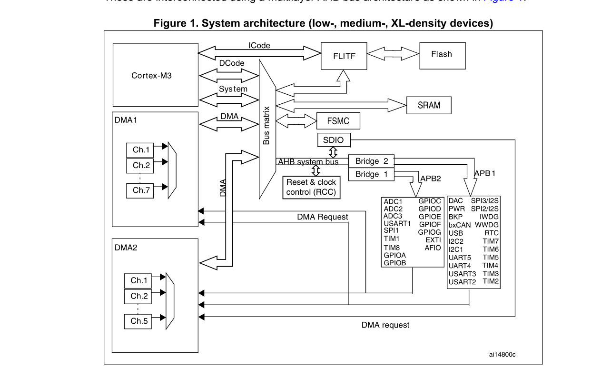

# STM32F103TB记录

[TOC]

> MDK-ARM5.10 + 外设库3.5.0

## 系统结构图

- 

## 时钟树

- 

## 时钟配置

- 

- 配之前需先理解启动流程 可阅读startup_stm32f10x_md.s stm32f10x.h 和 system_stm32f10x.c文件说明。明确哪些是需要修改。
- .s 启动文件中定义 程序入口函数 SystemInit main;所以不用在main函数中再调用SystemInit
- stm32f10x.h中定义HSE_VALUE 外部晶振频率 和 HSI_VALUE定义内部晶振频率。
- system_stm32f10x.c 中定义SYSCLK_FREQ_72MHz或其它。   
  1. HSE二分频设为PLLSRC的时钟源再9倍频设为SystemClock始终源
  
  2. 设置HCLK频率
   